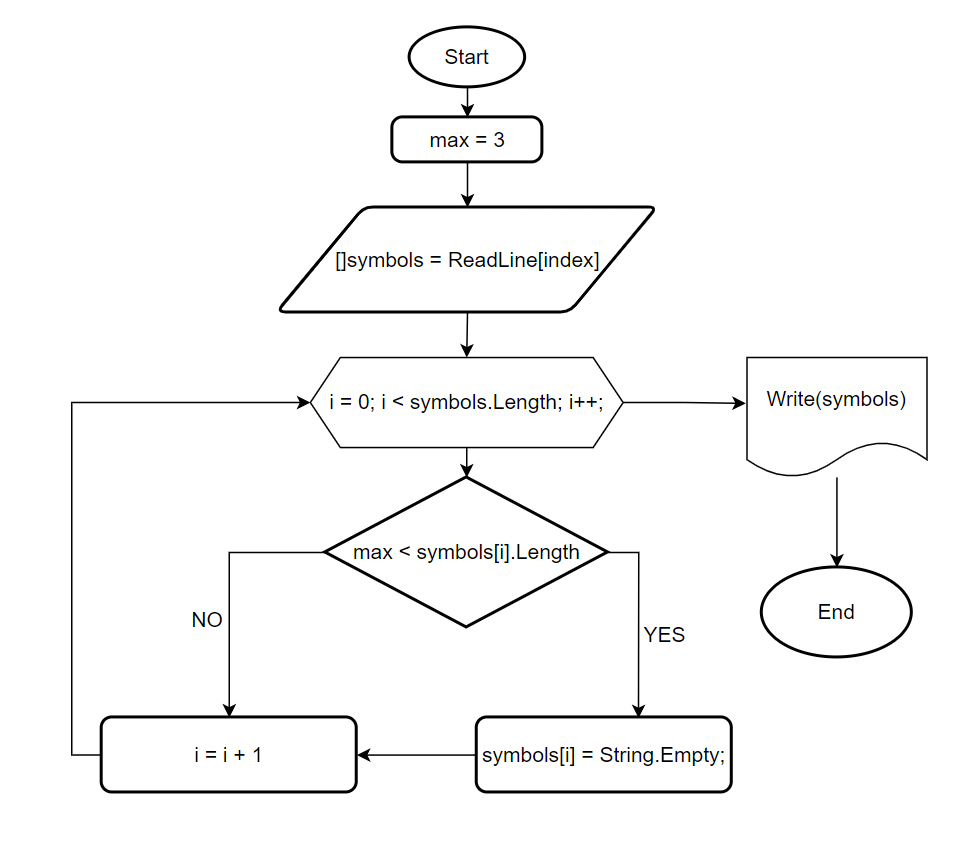

# Итоговая проверочная работа

## **Этап 1.** Описание задачи

Написать программу, которая из имеющегося массива строк формирует массив из строк, длина которых меньше ил равна 3 символа. Первоночальный массив можно ввести с клавиатуры, либо задать на старте выполнения алгоритма. При решении не рекомендуется пользоваться коллекциями, лучше обойтись исключительно массивами.
__Примеры:__ 
* ["Hello", "2", "world", ":-)"] -> ["2", ":-)"]
* ["1234", "1567", "-2", "computer science"] -> ["-2"]
* ["Russia", "Denmark", "Kazan"] -> []

## **Этап 2.** Блок схема
Для начала нарисуем блок схему:



## **Этап 3.** Решение задачи
А вот и код, решение находиться в папке **solution**. Ниже я описал весь процесс выполнения кода.
```
Console.Clear();
Console.Write("Введите строки через пробел: ");
int max = 3;
string[] symbols = Console.ReadLine()!.Split(' ', StringSplitOptions.RemoveEmptyEntries);

for (int i = 0; i < symbols.Length; i++)
{
    if (max < symbols[i].Length)
    {
        symbols[i] = String.Empty;
    }
}
Console.WriteLine($"[{String.Join(",", symbols)}]");

```
## Построчное описание выполнения кода
1. **Console.Clear();**, очищаем терминал.
2. **Console.Write("Введите строки через пробел: ");** - Выводим в терминал информацию о том что нужно ввести данные.
3. **int max = 3;** - Создаём переменную для дальнейшей работы с ним.
4. **string[] symbols = Console.ReadLine()!.Split(' ', StringSplitOptions.RemoveEmptyEntries);** - В массив *"symbols"*  присваиваем значения введенные пользователем. 
5. **for (int i = 0; i < symbols.Length; i++)** - Тут вводим счетчик
6. **if (max < symbols[i].Length)** - проверяем условие, если *"max"* со значением 3, меньше текущей строки. Если да, то переходим на следующий пункт(7).
7. **symbols[i] = String.Empty;** - присваиваем данному индексу пустое значение. 
8. **Console.WriteLine($"[{String.Join(",", symbols)}]");** - печатаем получившийся результат.